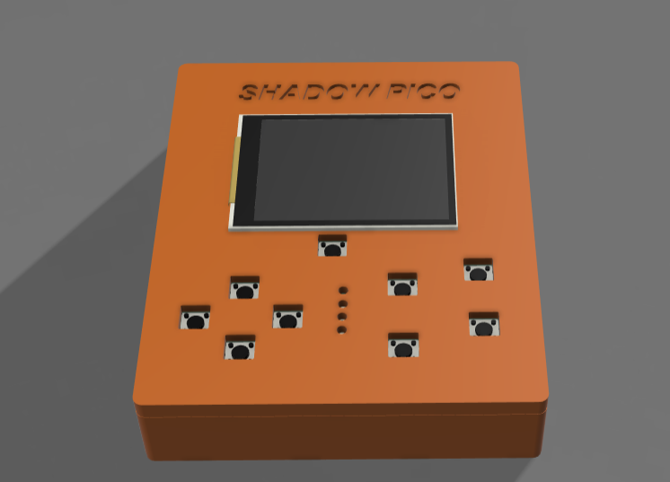
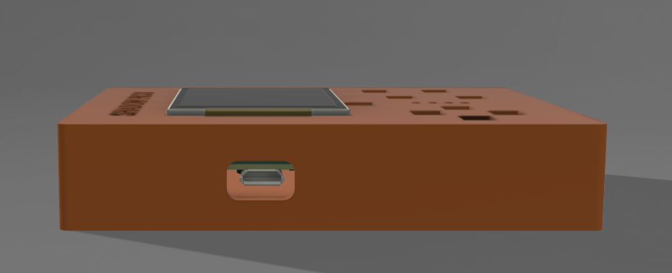
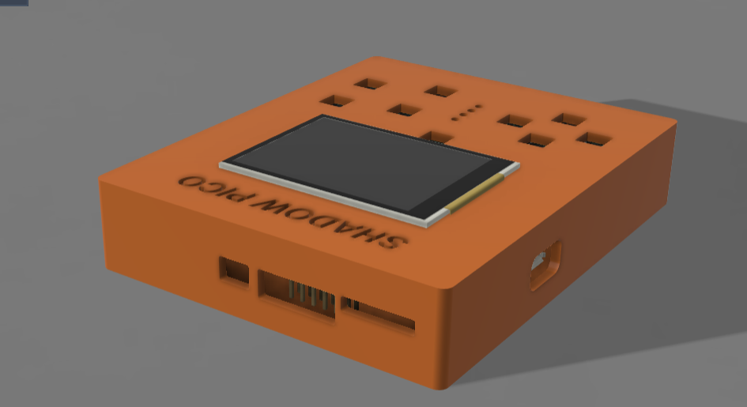
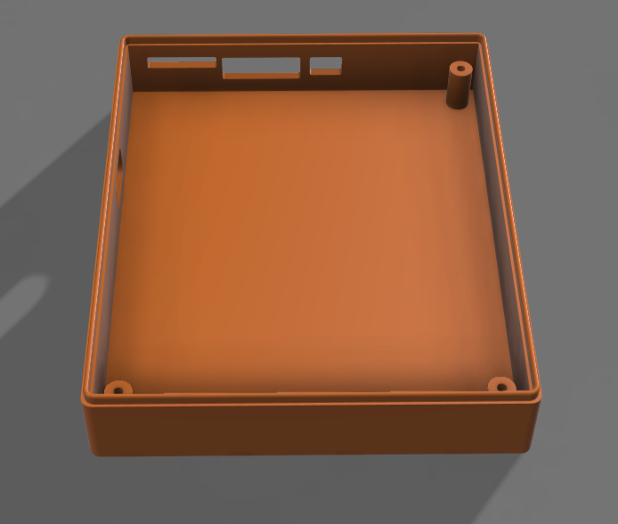
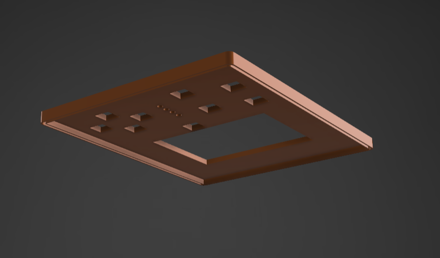
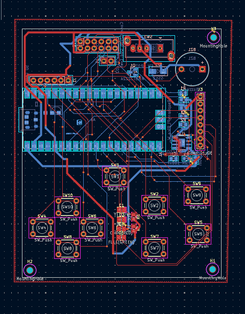
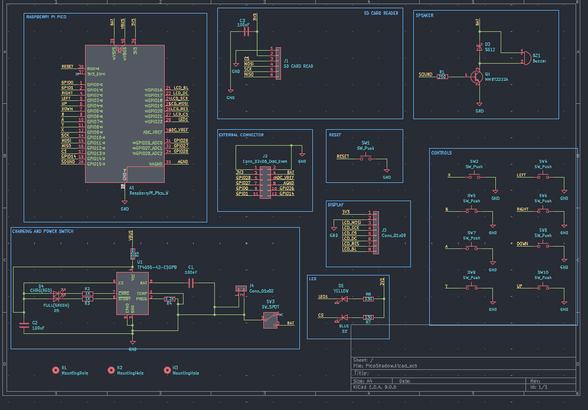

# SHADOW PICO  
It is a handheld device that works on Raspberry Pi Pico

# Model  
This is the final look of the device  
  

I have added a small hole on the side for usb  
  

On the front there are 3 holes for the SD Card , External Connector and a Slide switch for power  
  

I have used ridges to attach the bottom case to the top case!  
Bottom Case :  
  
Top Case :  
  

# PCB  
This is the PCB ( ground pour is hidden )  
  

And here are the schematics!  
  

# Firmware  
I have uploaded the basic code for arduino to identify buttons right now , will add the games after i get the card!  

# BOM  
|PRODUCT                 |QUANTITY  |PER UNIT COST|TOTAL COST |PRODUCT LINK                                                                                                                                                                                                                                                                                                                                                                                                                                                     |
|------------------------|----------|-------------|-----------|-----------------------------------------------------------------------------------------------------------------------------------------------------------------------------------------------------------------------------------------------------------------------------------------------------------------------------------------------------------------------------------------------------------------------------------------------------------------|
|                        |          |             |           |                                                                                                                                                                                                                                                                                                                                                                                                                                                                 |
|Raspberry Pi Pico       |1         |4$           |4$         |https://robu.in/product/raspberry-pi-pico/                                                                                                                                                                                                                                                                                                                                                                                                                       |
|                        |          |             |           |                                                                                                                                                                                                                                                                                                                                                                                                                                                                 |
|Waveshare 2 inch LD     |1         |10.40$       |14.40$     |https://robu.in/product/waveshare-2-inch-lcd-display-module-240x320/                                                                                                                                                                                                                                                                                                                                                                                             |
|                        |          |             |           |                                                                                                                                                                                                                                                                                                                                                                                                                                                                 |
|TP4056 ( Charging IC )  |1         |0.13$        |14.53$     |https://robu.in/product/1-month-warranty-1253/                                                                                                                                                                                                                                                                                                                                                                                                                   |
|                        |          |             |           |                                                                                                                                                                                                                                                                                                                                                                                                                                                                 |
|MMBT2222A ( Transistor )|1         |0.02$        |14.55$     |https://robu.in/product/mmbt2222a-tp-mcc-40v-350mw-100150ma10v-600ma-npn-sot-23-bipolar-bjt-rohs/                                                                                                                                                                                                                                                                                                                                                                |
|                        |          |             |           |                                                                                                                                                                                                                                                                                                                                                                                                                                                                 |
|Diodes                  |3         |0.03$        |14.64$     |https://robu.in/product/ss12-slkor-20v-500mv1a-1a-smado-214ac-schottky-diodes-rohs/                                                                                                                                                                                                                                                                                                                                                                              |
|                        |          |             |           |                                                                                                                                                                                                                                                                                                                                                                                                                                                                 |
|Resistors               |8         |0.03$        |14.88$     |https://robu.in/product/rt0805brd071kl-yageo-125mw-thin-film-resistor-150v-%c2%b125ppm-%e2%84%83-%c2%b10-1-1k%cf%89-0805-chip-resistor-surface-mount-rohs/                                                                                                                                                                                                                                                                                                       |
|                        |          |             |           |                                                                                                                                                                                                                                                                                                                                                                                                                                                                 |
|Capacitor               |3         |0.01$        |14.91$     |https://robu.in/product/100nf-0805-surface-mount-multilayer-ceramic-capacitor-pack-of-40/                                                                                                                                                                                                                                                                                                                                                                        |
|                        |          |             |           |                                                                                                                                                                                                                                                                                                                                                                                                                                                                 |
|PCB                     |5(minimum)|2$           |25.67$     |https://jlpcb.com                                                                                                                                                                                                                                                                                                                                                                                                                                                |
|                        |          |             |           |                                                                                                                                                                                                                                                                                                                                                                                                                                                                 |
|LED                     |4         |0.01$        |25.70$     |https://robu.in/product/0805-surface-mount-led-yellow/                                                                                                                                                                                                                                                                                                                                                                                                           |
|                        |          |             |           |                                                                                                                                                                                                                                                                                                                                                                                                                                                                 |
|Tactile Switches        |10        |0.01$        |25.87$     |https://robu.in/product/6x6x5-tactile-push-button-switch/                                                                                                                                                                                                                                                                                                                                                                                                        |
|                        |          |             |           |                                                                                                                                                                                                                                                                                                                                                                                                                                                                 |
|Slide Switch            |1         |0.07$        |26$        |https://robu.in/product/1-month-warranty-257/                                                                                                                                                                                                                                                                                                                                                                                                                    |
|                        |          |             |           |                                                                                                                                                                                                                                                                                                                                                                                                                                                                 |
|External Header         |1         |0.50$        |26.50$     |https://robu.in/product/ds1029-10-2x6p8bva1-b-connfly-2x6-pin-2-54mm-pin-header-double-row-stack-v-t-w-post-type/                                                                                                                                                                                                                                                                                                                                                |
|                        |          |             |           |                                                                                                                                                                                                                                                                                                                                                                                                                                                                 |
|Buzzer                  |1         |0.50$        |27$        |https://robu.in/product/1-month-warranty-1231/                                                                                                                                                                                                                                                                                                                                                                                                                   |
|                        |          |             |           |                                                                                                                                                                                                                                                                                                                                                                                                                                                                 |
|LiPo Cell 3.7V Battery  |1         |4$           |31$        |https://robu.in/product/950mah-pcm-protected-micro-li-po-battery/                                                                                                                                                                                                                                                                                                                                                                                                |
|                        |          |             |           |                                                                                                                                                                                                                                                                                                                                                                                                                                                                 |
|SD Card Reader          |1         |0.50$        |31.50$     |https://robu.in/product/sd-card-reading-writing-module-arduino/#tab-questions                                                                                                                                                                                                                                                                                                                                                                                    |
|                        |          |             |           |                                                                                                                                                                                                                                                                                                                                                                                                                                                                 |
|SD Card                 |1         |3$           |34$        |https://www.flipkart.com/avoc-flash-mc016-microsdxc-16-gb-microsd-card-class-10-20-mb-s-memory-compatible-tablet-mobile-camera/p/itm6992565b2daec?pid=ACCHG3F8GXFTJ2ZB&lid=LSTACCHG3F8GXFTJ2ZBBBBRM3&marketplace=FLIPKART&store=6bo%2Fjdy%2Ftby&spotlightTagId=default_TrendingId_6bo%2Fjdy%2Ftby&srno=b_1_4&otracker=browse&fm=organic&iid=b3d76566-40fa-4945-9e8a-c26acff24796.ACCHG3F8GXFTJ2ZB.SEARCH&ppt=browse&ppn=browse&ssid=o5mxucwjzzgcimtc1765750789965|
|                        |          |             |           |                                                                                                                                                                                                                                                                                                                                                                                                                                                                 |
|3D Print                |          |3-4$         |38$        |                                                                                                                                                                                                                                                                                                                                                                                                                                                                 |
|                        |          |             |           |                                                                                                                                                                                                                                                                                                                                                                                                                                                                 |
|                        |          |TOTAL        |40$ Approx!|                                                                                                                                                                                                                                                                                                                                                                                                                                                                 |

